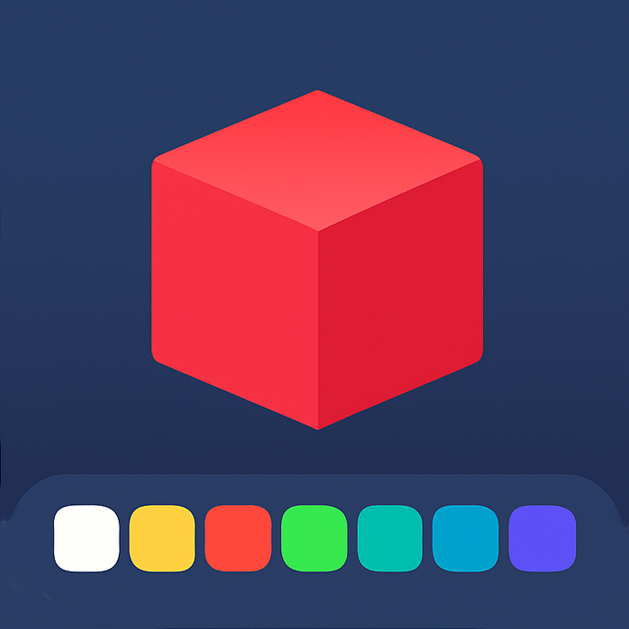

# 3D Modeling for Kids



A browser-based 3D modeling application designed for children, featuring simple cube-based building mechanics with professional visual quality and export capabilities for 3D printing.

## Features

- **Simple Building**: Place and remove colorful cubes to create 3D models
- **16 Vibrant Colors**: Choose from a carefully selected color palette
- **Professional Interface**: Clean, modern design with glass morphism effects
- **3D Printing Ready**: Export models as STL files for 3D printing
- **Multi-Platform**: Works on desktop, tablet, and mobile devices
- **Touch-Friendly**: Optimized for touch interactions on tablets

## How to Use

1. **Building Mode**: Click in empty space to place cubes adjacent to existing cubes
2. **Remove Mode**: Toggle the remove tool and click on cubes to delete them
3. **Color Selection**: Choose from 16 colors in the floating color picker
4. **Navigation**:
   - Mouse: Left-click drag to rotate, scroll to zoom, right-click drag to pan
   - Touch: Pinch to zoom, two-finger drag to pan, single finger to rotate
5. **Export**: Click the export button to download your model as an STL file
6. **Clear**: Remove all cubes to start fresh

## Technology Stack

- **Babylon.js**: Professional 3D engine with TypeScript support
- **React**: Modern UI framework
- **TypeScript**: Type-safe development
- **Tailwind CSS**: Utility-first styling
- **shadcn/ui**: Premium component library
- **Vite**: Fast build tool

## Development

```bash
# Install dependencies
npm install

# Start development server
npm run dev

# Build for production
npm run build

# Preview production build
npm run preview
```

## Requirements

- Modern browser with WebGL 2.0 support
- Chrome 80+, Firefox 75+, Safari 13+, Edge 80+

## License

MIT License - feel free to use this project for educational purposes.
